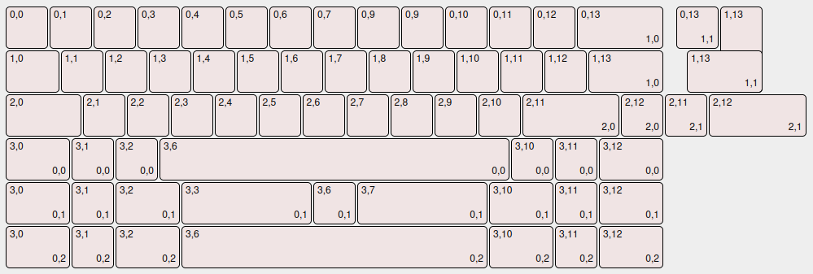

# Mintaka-50

A liminal inspired Keyboard with ALPS Support

---

### Current Status:

- Prototypes arrived; fully tested and working 

- Case Design in Progress // not tested 

---

## Mintaka-50:

the smallest keyboard of my three-board-series named after the three bright stars forming the omnipresent orion belt you can perceive within the night. 

This keyboard was heavily inspired by _The Liminal_ by _The_Royal_ found [here]((https://theroyalprojectscom.wordpress.com/portfolio-2/liminal/)) and was originally planned as drop-in replacement for the actual keyboard. Due to Layout issues, I dropped the plan and went with a new Design. Because the amount of columns and rows is rather small, I went with the cheap and easily available Atmega32u2. 

If you wish to order your own pcb and case, you can find all the necessary files within this repository 

---

## Features:

- Pinouts for additional WSB28 / SK61 Leds ( have to be implement in firmware afterwards)

- gasket mounted case with four screw-holes that is intended to be 3d printed

- Different layout options: 

- Support for Vial / Via

- Supports both alps and mx-style switches 

---

## Images:

